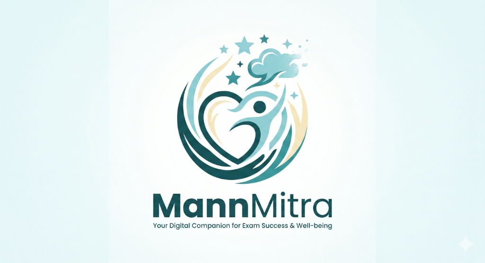

<div align="center">
  

  <h1>MannMitra</h1>
  <p><strong>Your Digital Companion for Exam Success & Well-being</strong></p>

  <p>
    
    
    
    
    
  </p>

  <p>
    MannMitra is an AI-powered mental wellness companion built specifically for Indian competitive exam aspirants — JEE, NEET, UPSC, and beyond. It combines real-time emotional support, neuroscience-backed mindfulness tools, and smart journaling into one seamless experience.
  </p>
</div>

---

## ✨ Features

### 🤖 AI Companion Chat
- **Text + Voice support** — type your thoughts or hold the mic button to speak
- **Streaming responses** — character-by-character typewriter output with live stress detection
- **Smart fallback** — fully works offline with a local response engine when no API key is configured
- **Stress-aware responses** — detects `calm → tired → stressed → overwhelmed` states and adapts tone dynamically

### 🫁 Physiological Sigh Pacer
- Animated two-step inhale (80% → 100% expand) followed by a 6-second slow exhale
- Based on Dr. Andrew Huberman's research on the fastest way to reduce acute stress

### 😴 NSDR Audio Session
- 10-minute Non-Sleep Deep Rest countdown with scrubber control
- Live CSS audio equalizer animation
- Inspired by Dr. Huberman's NSDR protocol for restoring neural plasticity

### 👁️ Panoramic Vision Exercise
- Full in-tab card with rippling violet rings expanding from a central red dot
- One-click fullscreen immersive mode
- Activates peripheral vision to down-regulate tunnel-vision anxiety

### 📓 AI Journaling
- Free-text journaling with emotion detection (`High Anxiety`, `Exhaustion`, `Calm Focus`)
- Trigger extraction from journal text (mock tests, backlog, sleep)
- History saved locally — feeds the dashboard stress analytics

### 📊 Dashboard
- Real-time stress gauge with animated SVG donut chart
- Weekly focus hours bar chart & stress state distribution
- Mitra's personalized daily note and quick action cards

### 🚨 Crisis Safety Interceptor
- Local keyword scanner running on every message *before* any API call
- Instantly surfaces a high-contrast modal with Indian crisis helplines:
  - **iCall** (9152987821)
  - **Vandrevala Foundation** (1860-2662-345)
  - **AASRA** (9820466627)

---

## 🧱 Tech Stack

| Layer | Technology |
|---|---|
| Framework | Next.js 16 (App Router, Turbopack) |
| UI | React 19, TailwindCSS v4 |
| Language | TypeScript 5 |
| AI Backend | Groq (llama3-8b-8192) / OpenAI — streaming SSE |
| Voice Input | `navigator.mediaDevices.getUserMedia` + Web Speech API |
| Voice Output | Windows SAPI5 via PowerShell (fallback: synthetic WAV) |
| Data Storage | Browser `localStorage` — no database, no auth |
| Testing | Vitest 4, jsdom, React Testing Library |

---

## 🗂️ Project Structure

```
src/
├── app/
│   ├── page.tsx               # Landing page
│   ├── companion/page.tsx     # Main 5-tab companion app
│   ├── api/
│   │   ├── chat/route.ts      # Streaming LLM chat endpoint
│   │   └── voice/route.ts     # Voice audio I/O endpoint
│   └── globals.css
├── components/
│   ├── Sidebar.tsx            # Navigation sidebar (logo → home reset)
│   └── CompanionChat.tsx      # Core chat UI with hold-to-talk & safety layer
├── hooks/
│   └── useTypewriter.ts       # Character streaming hook
├── lib/
│   └── mitra-agent.ts         # Stress detection & fallback response engine
public/
└── logo.png                   # MannMitra brand logo
```

---

## 🚀 Getting Started

### Prerequisites
- Node.js 18+
- npm or yarn

### Installation

```bash
git clone https://github.com/prahasanp07/mann-mitra.git
cd mann-mitra
npm install
```

### Environment Variables (Optional)

Create a `.env.local` file. The app works fully without any API keys using the built-in local response engine.

```env
# Option A: Groq (free tier — recommended)
GROQ_API_KEY=your_groq_api_key_here

# Option B: OpenAI
OPENAI_API_KEY=your_openai_api_key_here
OPENAI_API_BASE=https://api.openai.com/v1
LLM_MODEL=gpt-4o-mini
```

### Run Development Server

```bash
npm run dev
```

Open [http://localhost:3000](http://localhost:3000) in your browser.

---

## 🧪 Running Tests

```bash
npm run test          # Run all 36 tests once
npm run test:watch    # Live watch mode
```

Test coverage includes:
- `mitra-agent.ts` — stress detection, trigger token generation
- `useTypewriter.ts` — streaming typewriter hook
- `api/route.test.ts` — chat & voice API logic
- `CompanionChat.test.tsx` — UI render, safety modal, widget triggers, recording state

---

## 📱 App Tabs

| Tab | What it does |
|---|---|
| **Companion** | AI chat with voice & text, real-time stress tracking |
| **Dashboard** | Stress gauge, weekly progress, Mitra's daily note |
| **AI Journal** | Reflective text entries with emotion analysis |
| **Insights** | Weekly analytics charts, NSDR session launcher |
| **Mindfulness** | Box Breathing timer · Physiological Sigh · Panoramic Vision |

---

## 🔒 Privacy

All data — chat history, journal entries, onboarding profile — is stored **exclusively in your browser's localStorage**. Nothing is ever sent to a third-party server unless you configure an external LLM API key.

---

## 🧠 Neuroscience References

| Feature | Source |
|---|---|
| Physiological Sigh | Huberman Lab — cyclic sighing study (2023) |
| NSDR Protocol | Dr. Andrew Huberman — Non-Sleep Deep Rest |
| Panoramic Vision | Huberman Lab — visual field & stress regulation |
| Box Breathing | US Navy SEAL stress inoculation protocol |

---

## 🤝 Contributing

Pull requests are welcome! For major changes, please open an issue first.

1. Fork the repo
2. Create your feature branch (`git checkout -b feature/my-feature`)
3. Commit your changes (`git commit -m 'Add my feature'`)
4. Push to the branch (`git push origin feature/my-feature`)
5. Open a Pull Request

---

## 📄 License

MIT © 2026 [prahasanp07](https://github.com/prahasanp07)

---

<div align="center">
  <p>Built with ❤️ for every aspirant who needs someone in their corner.</p>
  <p><em>"Take a deep breath. You're doing great."</em> — Mitra</p>
</div>
